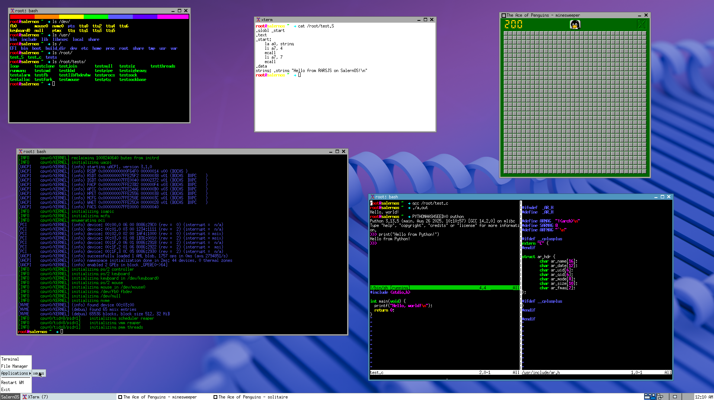

<p align="center">
    <h1 align="center">SalernOS Kernel</h1>
    <p align="center">Almost usable x86-64 Unix-like kernel</p>
</p>

<div align="center">

[contributors-shield]: https://img.shields.io/github/contributors/Alessandro-Salerno/SalernOS-Kernel.svg?style=flat-square
[contributors-url]: https://github.com/Alessandro-Salerno/SalernOS-Kernel/graphs/contributors
[forks-shield]: https://img.shields.io/github/forks/Alessandro-Salerno/SalernOS-Kernel.svg?style=flat-square
[forks-url]: https://github.com/Alessandro-Salerno/SalernOS-Kernel/network/members
[stars-shield]: https://img.shields.io/github/stars/Alessandro-Salerno/SalernOS-Kernel.svg?style=flat-square
[stars-url]: https://github.com/Alessandro-Salerno/SalernOS-Kernel/stargazers
[issues-shield]: https://img.shields.io/github/issues/Alessandro-Salerno/SalernOS-Kernel.svg?style=flat-square
[issues-url]: https://github.com/Alessandro-Salerno/SalernOS-Kernel/issues
[license-shield]: https://img.shields.io/github/license/Alessandro-Salerno/SalernOS-Kernel.svg?style=flat-square
[license-url]: https://github.com/Alessandro-Salerno/SalernOS-Kernel/blob/master/LICENSE.txt

[![Contributors][contributors-shield]][contributors-url]
[![Forks][forks-shield]][forks-url]
[![Stargazers][stars-shield]][stars-url]
[![Issues][issues-shield]][issues-url]
[![MIT License][license-shield]][license-url]


</div>

<div align="center">
  
</div>

## Features
As of kernel release 0.2.4, it is now possible to run a variety of programs. Ports for some well-known applications are available in the [SalernOS](https://github.com/Alessandro-Salerno/SalernOS) repository (as redistributions of those used by [Gloire](https://github.com/Ironclad-Project/Gloire) and [Astral](https;//github.com/Mathewnd/Astral)). Included are ports for the likes of Xorg, Vim, GNU Coreutils, GCC, GNU Binutils, mlibc, xterm, and more.

The kernel itself supports the following features:

- Platform-specific
  - x86-64
    - [x] GDT
    - [x] IDT
    - [x] PIT
    - [x] LAPIC
    - [x] LAPIc Timer 
    - [x] IOAPIC
    - [x] MMU (4-level paging)
    - [x] Invariant TSC
    - [x] PS/2 keyboard & mouse
    - [x] QEMU I/O Port `0xE9` logging 
    - [x] SCE (System Call Extension)
- Common code
  - Memory management
    - [x] PMM
    - [x] Slab allocator
    - [x] VMM
    - [x] Copy on write
    - [ ] Page cache
  - System management
    - [x] System Call Interface
    - [x] Callout (Timer multiplexer)
    - [x] ELF loading
    - [x] Interrupt management
    - [x] Kernel panic
    - [x] SMP Preemptive scheduler (RR)
  - Process management
    - [x] Processes
    - [x] Threads (with userspace API)
    - [x] Job control
  - Input/Output Software Interfaces
    - [x] TTY
    - [x] PTY
    - [x] VT-ish subsystem and multiplexing (KTTY & Kernel Console)
    - [x] Kernel log
  - Device Abstraction Layer (HAL)
    - [x] Terminal
    - [x] Keyboard
    - [x] Mouse
    - [ ] Block device
  - Abstract devices
    - [x] Linux-compatible framebuffer device
    - [x] `/dev/null`
    - [ ] `/dev/zero`
    - [ ] `/dev/urandom`
  - Inter-process communication (IPC) and synchronization
    - [x] Pipes
    - [x] UNIX domain sockets
    - [x] Signals
    - [x] Futex (Fast Userspace Mutex)
    - [ ] Shared memory
    - [ ] Message queues
    - [ ] FIFOs (Named pipes)
  - File system
    - [x] Virtual File System (VFS)
    - [x] initrd
    - [x] iovec (optional)
    - [x] pipefs
    - [x] sockfs
    - [x] tmpfs
    - [x] devfs
    - [ ] ext2
  - Kernel library and data structures
    - [x] Hashmap
    - [x] Radix tree (XArray)
    - [x] Ring buffer
    - [x] Spinlock
    - [x] Mutex
    - [x] Vectored I/O Iterator
    - [x] libc-like functions
- Compiletime modules (a.k.a. "options", see [src/opt](./src/opt/))
  - [x] [flanterm](https://codeberg.org/Mintsuki/Flanterm)
  - [x] ACPI
  - [x] [uACPI](https://github.com/uACPI/uACPI)
  - [x] PCI/PCIe
  - [x] NVMe (basic 1.0e support)
  - [ ] XHCI
  - [ ] USB
- Build system and source structure
  - Platform abstraction: platform-specific code is placed in special directories and implements the platform interface defined in [include/platform](./include/platform)
  - Features that may be common to some platforms are held in [src/opt](./src/opt) and may be turned on or off by platform implementations
  - Common code shall not assume the presence of any option, but platform-specific code is allowed to do so
  - Types, functions, and variables follow strict naming conventions
  - Configuration is done via [config/config.h](./config/config.h) and other ifles in the [config](directory)
  - All headers go in the [include](./include) directory, except for headers within options which are not visible to the rest of the code. Headers from external projects shall be placed under [include/vendor](./include/vendor)
  - Options and platform implementations shall provide files required by the build system such as `useopt.mk` for options and `options.mk` for platforms

## Goals
The SalernOS Kernel is part of the [SalernOS Project](https://github.com/Alessandro-Salerno/SalernOS). The goal of the project is to "learn by doing", i.e. building an OS because it's fun and educational. In practical terms, this means that the ultimate goal of this Kernel is to be able to run all necessary programs and do so while following [POSIX](https://en.wikipedia.org/wiki/X86-64) as much as possible to allow programs from other systems (e.g., Linux) to run.

## History
Development on this Kernel started on December 12th, 2021. Since then, the source code has gone through many rewrites and has experienced long periods of stagnation. Development resumed in late 2024 after almost two years of inactivity. 

This is a personal project (hence the name) and holds a special place in my heart as it played a relatively significant role in my life for several years.

## How to build
### Requirements
- GNU C compatible compiler (like GCC - preferably `<arch>-salernos-mlibc-gcc`)
- Binutils
- NASM (for x86-64)
### Procedure
Simply run the following command and hit enter:
```
make -j8
```
> [!NOTE]
> This will only build the kernel executable for the target architecture (`bin/vmsalernos`). To build the full OS, use the tools in the [SalernOS Repository](https://github.com/Alessandro-Salerno/SalernOS).

## License
The SalernOS Kernel is distributed under the GNU General Public License (GPL) v3.0. More details in the [LICENSE](./LICENSE) file.

However, some external componets are included in this repository. Licenses for these components can be found in the [licenses](./licenses/) directory and can often be found at the top of related source files.

## Insipration and acknowledgements
- The initial learning material (used in 2021 for versions 0.0.1 - 0.0.3) came from [CodePulses'es YouTube videos](https://www.youtube.com/watch?v=FkrpUaGThTQ)
- The original architecture and structure for many componets written in 2022 (versions 0.0.4 - 0.0.6) came from AbsurdPoncho's YouTube videos. These videos have since been removed, but the original source code can still be found [here](https://github.com/Absurdponcho/PonchoOS)
- Changes made in 2023 (version 0.1.0) were inspired by the Lyre and [qword](https://github.com/qword-os/qword) operating systems
- The current architecture makes use of [Limine](https://github.com/limine-bootloader/limine) and [flanterm](https://github.com/mintsuki/flanterm) by [mintsuki](https://github.com/mintsuki) and contributors
- The current rewrite of the Kernel is partly inspired by the [Astral Operating System](https://github.com/Mathewnd/Astral) by [Mathewnd](https://github.com/Mathewnd)

