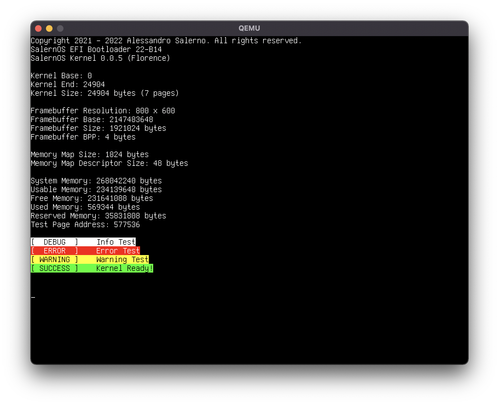

[contributors-shield]: https://img.shields.io/github/contributors/Alessandro-Salerno/SalernOS-Kernel.svg?style=flat-square
[contributors-url]: https://github.com/Alessandro-Salerno/SalernOS-Kernel/graphs/contributors
[forks-shield]: https://img.shields.io/github/forks/Alessandro-Salerno/SalernOS-Kernel.svg?style=flat-square
[forks-url]: https://github.com/Alessandro-Salerno/SalernOS-Kernel/network/members
[stars-shield]: https://img.shields.io/github/stars/Alessandro-Salerno/SalernOS-Kernel.svg?style=flat-square
[stars-url]: https://github.com/Alessandro-Salerno/SalernOS-Kernel/stargazers
[issues-shield]: https://img.shields.io/github/issues/Alessandro-Salerno/SalernOS-Kernel.svg?style=flat-square
[issues-url]: https://github.com/Alessandro-Salerno/SalernOS-Kernel/issues
[license-shield]: https://img.shields.io/github/license/Alessandro-Salerno/SalernOS-Kernel.svg?style=flat-square
[license-url]: https://github.com/Alessandro-Salerno/SalernOS-Kernel/blob/master/LICENSE.txt

[![Contributors][contributors-shield]][contributors-url]
[![Forks][forks-shield]][forks-url]
[![Stargazers][stars-shield]][stars-url]
[![Issues][issues-shield]][issues-url]
[![MIT License][license-shield]][license-url]

 

[](https://github.com/Alessandro-Salerno/SalernOS-Kernel/stargazers)


<p align="center">
    <h1 align="center">SalernOS Kernel</h1>
    <p align="center"> The SalernOS Kernel is a fundamental component of SalernOS: a toy OS I'm working on. </p>
</p>

<div align="center">
    
</div>

## Source Tree Strucutre
The source tree is structured as follows:
* `src` Contains all the source code for the core parts of the kernel
* `intf` Contains headers for kernel libraries
* `arch` Contains architecture-specific code (Not yet) and BootStandard-specific code, like the linker script used to link the kernel
* `kstd` Contains a pseudo C Standard Library for the kernel
* `klib` Contains code that is dependent on other parts of the kernel (Such as `kstd`, `include` and `src`), but are not important enough to keep inside the core source
* `make` Contains files included by the main `Makefile`
* `obj` Is created by the `Makefile` and contains the object files (`.o`) derived from the compilation of the kernel
* `bin` Is created by the `Makefile` and contains the final kernel ELF64 binary

## Setup
To set the environment up, just type `make setup` and hit enter.

## Building the Kernel
To compile the entire kernel, just type `make kernel` and hit enter.

### Requirements
* A C Compiler (GCC) for x86_64
* An assembler (NASM) for x86_64
* A linker (LD)
* Make

All required software is bundled with the [SalernOS-Buildenv](https://github.com/Alessandro-Salerno/SalernOS-Buildenv)

## Source Tree Naming Conventions
* Folders in the main directory must be named using short series of lowercase characters
* Subfolders must be named using `CamelCase` notation and may not exceed 1 word
* File names must **NOT** contain spaces or other special characters, and shall only consist of short series of lowercase characters

These rules do not apply to special files and folders such as Makefiles.

## C Source File Structure
* Source Files must contain commented notices, such as licenses, warnings and comments as their first sections.
* Source Files must contain Compiler Directives in order:
  * Include statements (From longest to shortest)
  * Macros and constants (Horizontaly aligned)
* Source Files can contain optional sections in the following order:
  * Type definitions
  * Static global variables (Horizontaly aligned)
  * Other global variables (Horizontaly aligned)
  * Static functions
  * Function implementations

Sections must be separated by two blank lines and the file must end with an empty line as well.

### Source File Example
```c
// LICENSE
// WARNING
// DESCRIPTION


#include <kerninc.h>
#include "other.h"


static bool     aStaticBool;
static uint32_t aStaticUint32;

bool     aBool;
uint32_t aUint32;


static void __static_function__() {
    return;
}


uint32_t kernel_other_implementation() {
    return 50;
}
```

## C Header File Structure
* Header Files must contain commented notices, such as licenses, warnings and comments as their first sections.
* Header Files must contain Compiler Directives in order:
  * Include guards
  * Include statements (From longest to shortest)
  * Macros and constants (Horizontaly aligned)
* Header Files can contain optional sections in the following order:
  * Type definitions
  * `extern` variables (Part of a table of variables comprised of two columns: type and name - Horizontaly and verticaly aligned)
  * Function declarations (Part of a table of functions comprised of three columns: return type, name and arguments - Horizontaly and verticaly aligned)
* Header Files must **NOT** contain:
  * Non `extern` global variables
  * Static functions
* The body of Header Files must be indented

### Header File Example
```c
#ifndef SALERNOS_CORE_KERNEL_HEADERFILE
#define SALERNOS_CORE_KERNEL_HEADERFILE

    #include <kerntypes.h>


    /*************************
           TYPE   NAME
    **************************/
    extern bool   anExternBool;


    /*********************************************
    RET TYPE  FUNCTION NAME             ARGUMENTS
    *********************************************/
    void      kernel_other_declaration  ();
  
#endif
```

The variables and functions tables must be organized as follows:
* The top border must start with `/` and end with `*` in the precise column where the bottom border ends
* The bottom border must start with `*` and end with `/`. If the header exceeds the longest element's length (Like in the function table example), the `/` must be one column to the right of the header. Otherwise, the `/` must be on the same column as the semicolon of the longest element

## Assembly File Structure
A structure for `.asm` files will soon be defined. In the meanwhile, try to match the style of existing files.

## Naming Conventions (For `src/`)
* Type names must follow the POSIX Standard type notation (`name_t`) and should be as short as possible
* Function names must follow the scheme `kernel_category_target_action`, such as `kernel_kdd_pxcolor_set` and `kernel_kdd_pxcolor_get`. If the category is the target, such as `kernel_mmap_initialize`, the `target` section can be dropped
* Static function names must follow the scheme `__action_target__`, such as `__get_pxptr__`
* Static global variables and global variables must use `pascalCase` notation
* Static local variables and local variables must be comprised of lowecase characters and must start with a `_` as in `_local_variable`
* Function arguments must be comprised of lowercase characters and must start with `__` as in `__function_argument`
* Struct fields must use `CamelCase` notation and must start with `_`
* Constants and macros defined using `#define` must be comprised of UPPERCASE characters, with words separated by `_` such as in `ARGRET(__arg, __val)` or `PIC1_COMMAND`
* Constants declared with `const` must be comprised of UPPERCASE characters, with words separated by `_` and must start with `_`, such as in `_KERNEL_START`

## Best Practices
* Use 4-space indentation
* Put brackets on the same line as the declaration
* Put `*` next to the type in pointer declarations (`int* p` not `int *p`)
* Avoid `if` statements whenever possible
* Try to use case-specific types (Such as `uint16_t`) instead of generic types like `int`
* Try to leave blank lines inside scopes to separate code areas
* Try to be as precise as possible with padding and spaces. Any request containing `(){` or `a=b` instead of `() {` and `a = b` **WILL BE REJECTED WITHOUT FURTHER INSPECTION**

## Branches
The `master` branch is used for the current **INDEV** version. A `support` branch will be created for every Kernel release (`kernel-florence-support` for example). 

## Roadmap
You can find the roadmap [here](https://trello.com/b/w0bPHjo6/roadmap)
