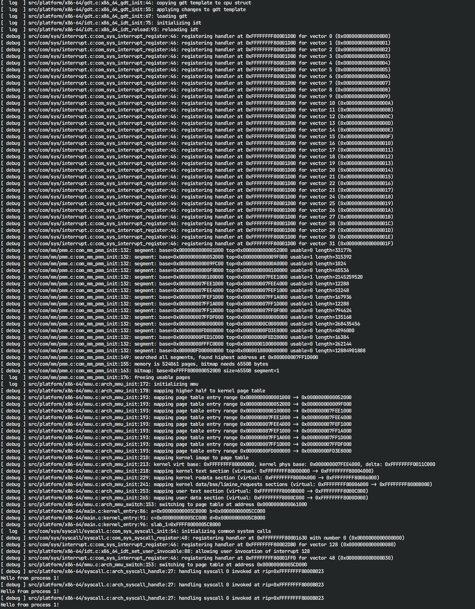

# SalernOS Kernel
This is a kernel project for educational purposes. This branch is a work-in-progress rewrite of the original [master](https://github.com/Alessandro-Salerno/SalernOS-Kernel/tree/glorious-2022) and [hellow](https://github.com/Alessandro-Salerno/SalernOS-Kernel/tree/hellow) branches which were themselves rewrites of previous versions.

  

  
SalernOS Kernel 0.2.0 logs in the QEMU monitor

