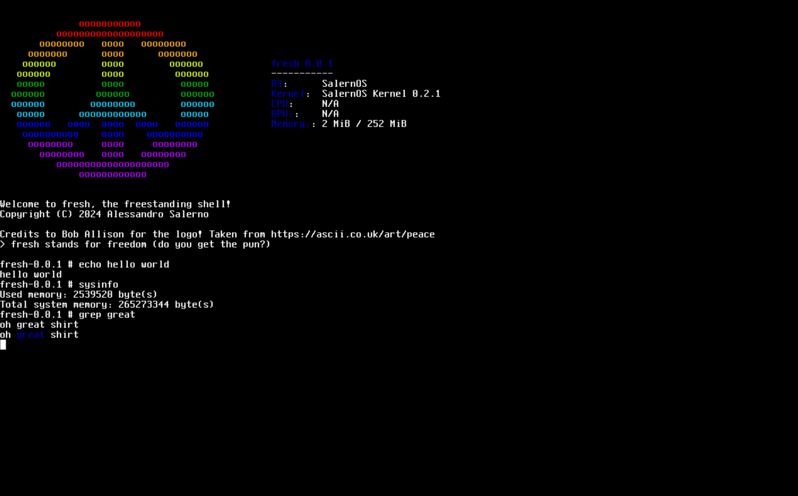

    <h1 align="center">SalernOS Kernel</h1>
    
 Tiny x86-64 Unix-like Kernel 

[contributors-shield]: https://img.shields.io/github/contributors/Alessandro-Salerno/SalernOS-Kernel.svg?style=flat-square
[contributors-url]: https://github.com/Alessandro-Salerno/SalernOS-Kernel/graphs/contributors
[forks-shield]: https://img.shields.io/github/forks/Alessandro-Salerno/SalernOS-Kernel.svg?style=flat-square
[forks-url]: https://github.com/Alessandro-Salerno/SalernOS-Kernel/network/members
[stars-shield]: https://img.shields.io/github/stars/Alessandro-Salerno/SalernOS-Kernel.svg?style=flat-square
[stars-url]: https://github.com/Alessandro-Salerno/SalernOS-Kernel/stargazers
[issues-shield]: https://img.shields.io/github/issues/Alessandro-Salerno/SalernOS-Kernel.svg?style=flat-square
[issues-url]: https://github.com/Alessandro-Salerno/SalernOS-Kernel/issues
[license-shield]: https://img.shields.io/github/license/Alessandro-Salerno/SalernOS-Kernel.svg?style=flat-square
[license-url]: https://github.com/Alessandro-Salerno/SalernOS-Kernel/blob/master/LICENSE.txt

[![Contributors][contributors-shield]][contributors-url]
[![Forks][forks-shield]][forks-url]
[![Stargazers][stars-shield]][stars-url]
[![Issues][issues-shield]][issues-url]
[![MIT License][license-shield]][license-url]

  

## What is a Kernel?
The Kernel is the "core" of the Operating System, it manaages resources and provides a Hardware Abstraction Layer and APIs to user applications. The SalernOS Kernel is one such program developed for educational purposes for the [x86-64](https://en.wikipedia.org/wiki/X86-64) architecture following the core principles of [Unix](https://en.wikipedia.org/wiki/Unix_philosophy). 

## Goals
The SalernOS Kernel is part of the [SalernOS Project](https://github.com/Alessandro-Salerno/SalernOS). The goal of the project is to "learn by doing", i.e. building an OS because it's fun and educational. In practical terms, this means that the ultimate goal of this Kernel is to be able to run all necessary programs and do so while following [POSIX](https://en.wikipedia.org/wiki/X86-64) as much as possible to allow programs ffrom other systems (e.g., Linux) to run.

## History
Development on this Kernel started on December 12th, 2021. Since then, the source code has gone through many rewrites and has experienced long periods of stagnation. Development resumed in late 2024 after almost two years of inactivity. 

This is a personal project (hence the name) and holds a special place in my heart as it played a relatively significant role in my life for several months.

## License
The SalernOS Kernel is distributed under the GNU General Public License (GPL) v3.0. More details in the [LICENSE](./LICENSE) file.

However, some external componets are included in this repository. Licenses for thos components can be found in the [license](./licenses/) directory and can often be found at the top of related source files.

## Insipration and acknowledgements
- The initial learning material (used in 2021 for versions 0.0.1 - 0.0.3) came from [CaodePulses' YouTube videos](https://www.youtube.com/watch?v=FkrpUaGThTQ)
- The original architecture and structure for many componets written in 2022 (versions 0.0.4 - 0.0.6) came from AbsurdPoncho's YouTube videos. These videos have since been removed, but the original source code can still be found [here](https://github.com/Absurdponcho/PonchoOS)
- Changes made in 2023 (version 0.1.0) were inspired by the Lyre and [qword](https://github.com/qword-os/qword) operating systems
- The current architecture makes use of [Limine](https://github.com/limine-bootloader/limine) and [flanterm](https://github.com/mintsuki/flanterm) by [mintsuki](https://github.com/mintsuki) and contributors
- The current rewrite of the Kernel is partly inspired by the [Astral Operating System](https://github.com/Mathewnd/Astral) by [Mathewnd](https://github.com/Mathewnd)

